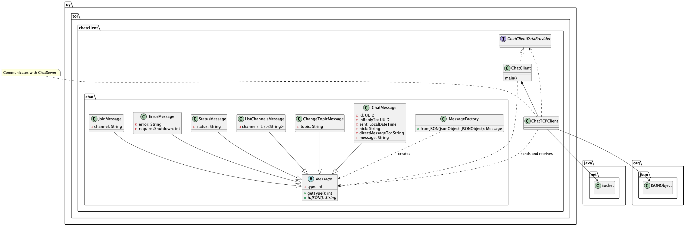

# O4 Chat Client

O4 Chat Client is a console chat client app for Ohjelmointi 4 (Programming 4) course. 

The client acts as an example of how to use the client side API to the [O4-server](https://github.com/anttijuu/o4-server).

**You** can then build your **own GUI chat client** using this project as an example on how to use the server API.

You may use the classes in the `oy.tol.chat` package in implementing your GUI client in Java. You may also use the `ChatTCPClient` implementation to connect to and use the chat server.

If you wish to implement a client with a different programming language, you can do that. The server API uses TCP for connecting and sending / receiving. Payload is JSON, so it is possible to use *any* programming language to implement different kinds of clients. See the 04-server for details on JSON message structures.

The O4-server is a chat server with the following main properties:

* Clients connect to the server using a TCP socket.
* There is no authentication of users, just connect and start chatting.
* User nick's are not (unfortunately) verified; several users can thus have the same nick. This may cause issues. Feel free to improve the server.
* The chat messages are not saved nor buffered on the server side, so you cannot view old messages, sent before the client connected.
* The server supports chat *channels* you can join. Only clients on the same channel can view messages sent to the channel.
* Each channel can have a topic any user may change.
* You can reply to a specific chat message. How this is done, is client implementation specific. This console client does not support this, at the moment.
* You can send *private messages* to a specific user using their nick. Note that the user must send at least one message; otherwise the server does not know the nick of the user and cannot forward any private messages to the user.
* You can join a server side bot channel if server is configured to have one. A bot channel reads messages from a text file and posts those periodically to the channel. This can be used to test clients and how they are able to receive messages from the server.

## Dependencies

The following are needed to build and run the client:

* JDK 15 or later
* Maven for building and packaging the executable.
* JSON library (see details from `pom.xml`)
* JColor for color output (optional, off by default)
* An IDE if you wish to view and/or edit the code.

The client app is structured as described in this high level UML class diagram:



* `ChatClient` is the command line UI for the app, running the show.
*  `ChatClient` uses the `ChatTCPClient` to connect to and send/receive messages with the remote ChatServer. `ChatTCPClient` listens to messages from the server and converts them from JSON to `Message` objects, passing them then to `ChatClient` for handling.
* An abstract `Message` class forms the basis for all types of messages. Any `Message` can convert itself to a JSON String using the method `toJSON()`.
* `ChatMessage`s are the actual chat messages users sent to and received from the server to talk with each others.
* `ChangeTopicMessage` is used to request channel topic change as well as received by the client when the channel topic changes.
* `JoinMessage` is used by the client when it wants to join an existing channel or open a new channel.
* `ListChannelsMessage` can be sent by the client when user wishes to view available channels. It is also sent by the server as a reply, containing the currently open channels.
* `StatusMessage` is a message server can use to tell clients about interesting events happening in the server.
* `ErrorMessage` is used by the server when something goes wrong in the server side or client has sent an erroneus request. It can also contain a flag to instruct the client to shut down when the server is itself shutting down.
* `MessageFactory` can be used to create `Message` objects from the JSON received from the server.
* `ChatTCPClient` does not directly use `ChatClient`, but accesses it using the callback interface class `ChatClientDataProvider`. When the TCP client needs the settings (nick, server address, etc.), it asks these from the client using this interface the `ChatClient` implements.

Important things to be aware of:

* **Note 1**: Not all details of the implementation are visible in this diagram.
* **Note 2**: The `ChatTCPClient` **must be executed in a thread**. `ChatTCPClient` calls *blocking* network functions to read and send data over the TCP socket. If you run the `ChatTCPClient` on the main thread of the application, this effectively blocks the GUI of the application. For an example on how to do this, see lines 99-100 in `ChatClient.java` on how to do this.
* **Note 3**: If you want to have several separate sessions to the server (e.g. using a different nick), or separate sessions to *different* servers, just create one `ChatTCPClient` for each of these connections. You will most probably also want to have different implementations of `ChatClientDataProvider` interface for these `ChatTCPClient` instances.
* **Note 4**: This command line client *does not support* the reply-to chat messages. UI does not provide any means to reply to a specific previous received message. Nor does the UI show if an incoming message is a reply to a previous sent or received message.

## Building the client

Build the client from command line:

`mvn package`

You should then have a subdirectory `target` including .jar files for running the client (see below).

If there are errors, check out the error output and sort out the issues.

You can also build and run the client from an IDE, e.g. Visual Studio Code or Eclipse (see below).

Windows Command prompt does not by default support UTF-8, so any special chars may end up not transferring properly. Prefer using the new Windows Terminal which does support UTF-8, or even better, use a proper terminal app such as Terminus (Win/Linux/macOS) or iTerm (macOS).

## Startup parameter and configuring the client

Whether you launch the client from terminal or VS Code, you must give it one startup parameter, the client configuration file.

The client configuration file looks like this:

```config
server=localhost:10000
nick=anttij
usecolor=true
```

* `server` is the **host name** of the server separated by `:`, following with the **port number** the server is listening to for incoming client connections. If you run the server on the same machine where the client is, use `localhost`. Check that the port is the same server is configured to use. Note that the server name must be known, that is it is located on the same local network or on a public server with known host name DNS can find.
* `nick` is the default user name to use when client is connecting to the server. You can change the nick when the client is running, though (see below).
* set `usecolor` to true if you want to use colourful output in the client. If this does not work correctly in your PC and terminal, set this to false.


## Running the client from terminal

First build the client, as instructed above.

Then run the server first, then launch the client. The client does run without the server running, obviously, but quits without a connection when you do anything (press enter on the client console).

Run the client by passing the name of the configuratio file as the one and only startup parameter.

You can launch the client either from the terminal:

```console
java -jar target\ChatClient-0.0.1-SNAPSHOT-jar-with-dependencies.jar chatclient.properties
```

or in *nix machines:

```console
java -jar target/ChatClient-0.0.1-SNAPSHOT-jar-with-dependencies.jar chatclient.properties
```

## Running the client from VS Code

If debugging from VS Code, you still need to give the startup parameter to the client as instructed above in **Running the client from terminal**. 

How to do that in VS Code? If you don't have launch configuration file `launch.json` already in the VS Code, add a launch configuration to the project. If you don't know how, [take a look at this manual](https://code.visualstudio.com/docs/editor/debugging#_launch-configurations).  

Make sure you edit the `args` configuration in the `launch.json`, seen in the image below in line 26, so that the arguments has the full path and file name of the `chatclient.properties` file:


Then when you launch the client (Run or Debug), use the **Launch ChatClient** launch configuration. That contains the launch configuration with startup parameters.

## Using the client

Run the client with the startup parameter, and you should then see the menu the client prints out. For commands available in the client, enter `/help` in the client. The available commands are:

```console
--- O4 Chat Client Commands ---
/nick      -- Specify a nickname to use in chat server
/join      -- Specify a channel to switch to in the chat server
/list      -- List the channels currently available in the chat server
/topic     -- Set a topic for the current channel
/color     -- Toggles color output on/off
/help, /?  -- Prints out this information
/info, /i  -- Prints out settings and user information
/exit      -- Exit the client app
 > To chat, write a message and press enter to send it.
```

You can pass the channel name, nick or topic as the parameter to the command, e.g.:

```console
/join ohjelmointi-4
```

or just give the command `/join` without any parameters, and then the channel name when the client asks for it:

```console
[14:35:24 @main]   anttij > /join
Change to channel > ohjelmointi-4
[14:35:30 @ohjelmointi-4]   anttij >
[14:35:30 @ohjelmointi-4]   SERVER > You left the channel main
[14:35:30 @ohjelmointi-4]   anttij >
[14:35:30 @ohjelmointi-4]   SERVER > You joined the channel ohjelmointi-4
```

Send messages by writing them to the prompt:

```console
[10:13:39 @main]   SERVER > status: You joined the channel main
[10:13:39 @main]   anttij >
[10:13:39 @main]   SERVER > channel topic is: Everything under the sun and moon
[10:13:39 @main]   anttij > Hello there!

[10:13:43 @main]   anttij >
```
And other connected clients on the same channel can see your message.

If you wish to send a private message to a known user connected to the server, add the `@nick` before the message:

```console
[10:13:39 @main]   SERVER > channel topic is: Everything under the sun and moon
[10:13:39 @main]   anttij > Hello there!

[10:13:43 @main]   anttij > @setämies Mitä kuuluu setämies?
```

And if the user `@setämies` is known to the server and connected, the message is relayed only to them.

> Note that if `@setämies` has not sent any messages, their nick is not known to the server and the private message cannot be relayed.


## More information

* (c) Antti Juustila 2020-2023, All rights reserved.
* MIT License (see LICENSE)
* INTERACT Research Unit, University of Oulu, Finland
