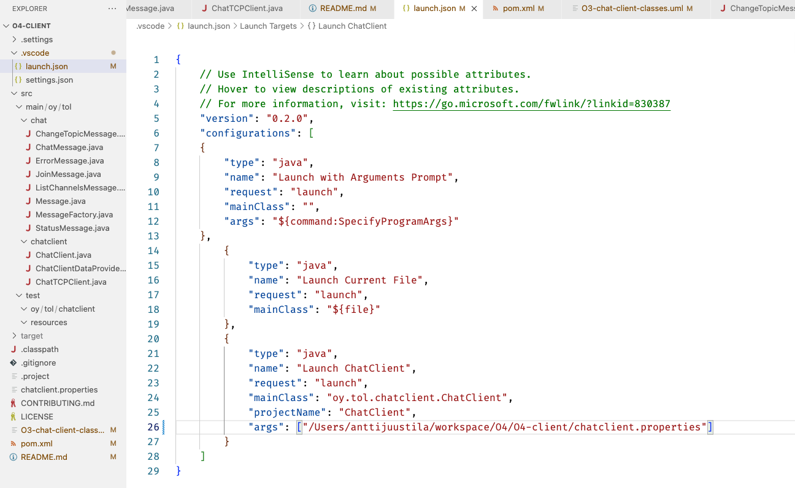

# O3 ChatClient

This project is a chat client app for Ohjelmointi 3 (Programming 3) course. The client acts as a test client for the server students are developing at the course.

The client works with a server that has the following things implemented:

* HTTPS support with self-signed certificate.
* Basic HTTP Authentication support.
* `/registration` and `/chat` paths implemented.

That is, after *Exercise 2* has been finished successfully. You may test your Exercise 2 implementation with the client as you work through the exercise. In Exercise 1, use curl as the test client.

> Note that you need to launch the client with one startup parameter. See instructions on those below. Note also that some demo videos are out of date since the startup parameters have been changed. 

[This demo video](https://youtu.be/FgANceteues) walks you through 1) how to get the code, 2) build it, 3) prepare the client with the self-signed certificate and 4) run it either from the command line or from VS Code. Note that since the video was made, JUnit tests were added to the project. This changes how to build the client from the command line. See instructions below from section *Building the client*. See also a video on running the tests in the [TESTS-README.md](TESTS-README.md).

## Background

The protocol to use the server is outlined in the interaction diagram below. For details, see the server API document at the course Moodle workspace.


The content of the HTTPS requests and responses are JSON. The JSON library to use is included in the Maven `pom.xml` file included in the project.

For details, see the course Exercise 2 instructions for the phase where HTTPS support is added to the server with a self signed certificate.

You must prepare the certificate for client use as instructed below. That client side certificate is then loaded in memory in `ChatHttpClient.createTrustingConnectionDebug`. How to do this is explained below in *Preparing the client* section.

**Note** that you *should not* run real servers with self-signed certificates publicly, this is just for development and learning purposes. Get a real certificate when deploying servers in the open and for real.

## Dependencies

The following are needed to build and run the client:

* JDK 15 or later
* Maven
* JSON library (see details from `pom.xml`)
* JUnit and related components
* JColor for color output (optional, off by default)
* An IDE if you wish to view and/or edit the code.

The client app is structured as described in this high level UML class diagram:


* `ChatClient` is the command line UI for the app, running the show.
* `ChatHttpClient` is used by the `ChatClient` to do the actual requests to the remote ChatServer.
* `ChatMessage`s are sent to and received from the server.
* `ChatHttpClient` does not "know" ChatClient, but accesses it using the interface class `ChatClientDataProvider`. When the http client wants the user settings (username, password, etc.), it asks these from the client using this interface the `ChatClient` implements.

Note that not all details of the implementation are visible in this diagram.

## Building the client

Build the client from command line:

`mvn package -DskipTests`

You should then have a subdirectory `target` including .jar files for running the client.

If you do not have a working server running -- the usual `mvn package` also executes tests, and if they do not pass, the .jar file is not left in the target directory.

For instructions on testing the server with the client, see [TESTS-README.md](TESTS-README.md).

If there are errors, check out the error output and sort out the issues.

You can also build and run the client from an IDE, e.g. Visual Studio Code or Eclipse.

The console UI in Eclipse may not work if debugging within Eclipse. In that case run the client from the command line.

Windows Command prompt does not by default support UTF-8, so any special chars may end up not transferring properly. Prefer using the new Windows Terminal which does support UTF-8, or even better, use a proper terminal app such as Terminus (Win/Linux/macOS) or iTerm (macOS).

## Preparing the client

Since we are using a self signed certificate in communicating with the server, you need to get the server's certificate to the client to allow it to use non secure certificates. Make sure the server has already been configured to use a self signed certificate you created, following the Exercise 2 instructions. 

You can either export the client side certificate using `keytool` or get it using your web browser.

Using keytool:

```console
keytool -export -alias localhost -keystore keystore.jks -rfc -file clientside.cer
```

Here `keystore.jks` is the certificate you created. This will produce the client side certificate in file `clientside.cer`. The ChatClient needs to use this `clientside.cer` certificate to access the server.
 
Using the web browser:

1. Run the server.
1. Using your web browser, access the server at `https://localhost:8001/chat`, assuming the server listens to port 8001.
1. You will likely get a warning about non secure certificate.
1. View the certificate (see link below for browser specific info), either from the warning or by clicking the browser's lock symbol to view the site certificate.
1. When viewing the certificate, you then save it to the local computer. How this happens depends on the browser, so check out [this link](https://www.shellhacks.com/get-ssl-certificate-from-server-site-url-export-download/).
1. Save the certificate as `clientside.cer` to the client app source directory, for example.

Next you should read how to run the client either form terminal or from within VS Code.

> Note that you *cannot* just copy the server certificate you created with `keytool` to the client. That is a private file of the server only, and **must not** be given to clients or anyone not authorized to access that certificate.

## Startup parameter and configuring the client

Whether you launch the client from terminal or VS Code, you must give it one startup parameter, the client configuration file.

The client configuration file looks like this:

```config
protocol=https
server=localhost:10001
format=application/json
modified-headers=true
certfile=/Users/anttijuustila/workspace/O3/O3-chat-client/localhost.cer
usecolor=true
```

* `protocol` should be either http or https, depending if your server supports or is configured to use http or https.
* `server` is the address of the server. In this course, the server is always run on the same machine, i.e. `localhost`. Check that the port is the same server is configured to use.
* `format` is the content type the server is using. This is either `text/plain` (start of the course) or `application/json` after JSON support has been implemented.
* `modified-headers` is true if the server supports using `If-Modified-Since` and `Last-Modified` headers.
* `certfile` is the client side certificate file you exported either using `keytool` or web browser above.
* `usecolor` is true if you want to use colourful output in the client. If this does not work correctly in your PC and terminal, set this to false.

Change these configurations as you implement your server following the course instructions. Remember to exit and relaunch the client when changing the configurations.

## Running the client from terminal

After you have build and prepared the client, you can run it.

Run the server first (on the same machine!), then launch the client. The client does run without the server, obviously, but registering, logging in, getting and posting messages will fail with an error message.

The default server address is found in the configuration file. You can change it from the app when it is running using the command `/server`. Note that this changed address in the app is not saved into the configuration file.

You can launch the client either from the terminal:

```bash
java -jar target\ChatClient-0.0.1-SNAPSHOT-jar-with-dependencies.jar chatclient.properties
```

or in *nix machines:

```bash
java -jar target/ChatClient-0.0.1-SNAPSHOT-jar-with-dependencies.jar chatclient.properties
```

If server response indicates an error for the request (success code is not 2xx), this client expects that the response body has a simple string describing what went wrong in the server. Client tries to read and display those to the user. If your server does not do this (there is no response body), an exception happens and is reported, but client should not crash.

## Running the client from VS Code

If debugging from VS Code, you still need to give the parameteres to the client as instructed above in 
**Startup parameter...**. How to do that in VS Code? If you don't have launch configuration file
`launch.json` already, add a launch configuration to the project. If you don't know how, [take a look at this manual](https://code.visualstudio.com/docs/editor/debugging#_launch-configurations).  

Make sure you edit the `args` configuration in the `launch.json`, seen in the image below in line 26, so that the arguments has the path and file name of the `chatclient.properties` file:



Then when you launch the client (Run or Debug), use the "Launch ChatClient" launch configuration as you can see selected in the
upper left corner of the image below (red underlining). That contains the launch configuration with startup parameters.

## Using the client

Note that the client fails to send and receive data if the server certificate file is not in the directory mentioned in the VS Code launch configuration or in the second command line parameter.

Run the client with the startup parameter, and you should then see the menu the client prints out. For commands 
available in the client, enter `/help` in the client. The usual process is:

1. First, `/register` the user with the server if not already registered. Unregistered users cannot send or get chats.
1. If user is already registered, `/login` with the registered user credentials.
1. Post new chat messages by writing the message to the console and pressing enter.
1. Get the latest messages from the server with command `/get`.
1. If the server seems to be working OK, enable automatically fetching new messages, once every second, using command `/auto`.
1. Open additional terminals and run the client there, login with different user account and chat with "the other person".
1. Exit the client app using the command `/exit`.

Test your server functionality with the client. In case you doubt the results, you can also use curl for
testing, following the course instructions. Curl also helps you in more detailed analysis, using the `--trace-ascii <filename>`
option you can use to see details of the comms between the client and the server.

If the server works with the client, your server should fulfill the requirements of the course, depending
on the other requirements listed in the course project requrements and Server API requirements.

## Executing unit tests with JUnit

The project includes unit tests with JUnit. Necessary dependencies are in the `pom.xml` file.

For instructions on how to execute the unit tests, see [TESTS-README.md](TESTS-README.md).

## More information

* (c) Antti Juustila 2020-2022, All rights reserved.
* MIT License (see LICENSE)
* INTERACT Research Unit, University of Oulu, Finland
